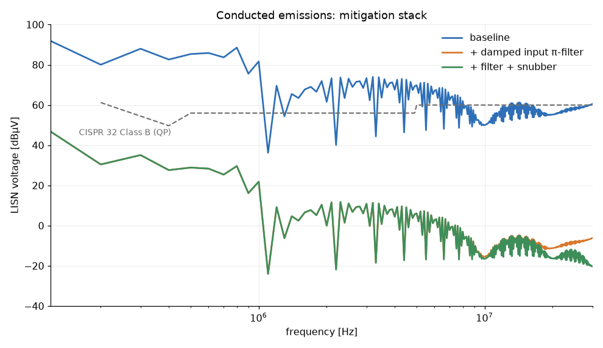

# EMC-pre-compliance-rig — near-field probe + SDR emissions rig for the 12 V→5 V buck

An EMC pre-compliance test setup — LISN + shielded-loop H probe + RTL-SDR
receiver — built around the closed-loop buck converter from the companion
[buck-converter](../buck-converter) repo (Project 1), plus a first-principles
emissions model that predicts what the rig will measure and quantifies four
mitigations (RC snubber, damped input filter, harness ferrite, hot-loop
layout) before a single part is ordered.

**DUT values are the real Project-1 numbers**, taken from
`buck-converter/python-model/parameters.py` and `design_report.txt`:
12 V→5 V, 2 A, fsw = 100 kHz, D = 0.454, ~100 ns edges, IRF9540N + SB540
hot loop, 470 µF/50 mΩ + 1 µF input caps. Bench data doesn't exist yet on
either the converter or this rig, so every physical parasitic in this model
is an **estimate flagged in `python/parameters.py` with the measurement
that replaces it**. The rig exists to produce those measurements.

## Headline results (all from `python/run_all.py` → `results/`)

| Quantity | Baseline | Mitigated | Mask |
|---|---|---|---|
| Conducted, worst line | 88 dBµV @ 300 kHz (**33.5 dB over**) | 35 dBµV (**+19.4 dB margin**) with damped π-filter | CISPR 32 B (QP) |
| Radiated @ 3 m, worst | 49 dBµV/m @ 41 MHz ring (**8.5 dB over**) | 22 dBµV/m (**+18.4 dB margin**) with snubber + ferrite + tight loop | CISPR 32 B scaled to 3 m |
| Stability side-effect | — | filter Middlebrook margin **24 dB by design** (undamped low-loss build: oscillates) | |
| Efficiency cost | — | snubber 22 mW; filter DCR ~0.24 W; edge-slowing option **rejected** (−2.2 pts for 6.8 dB) | |

## Repository map

| Folder | Contents |
|---|---|
| `python/` | emissions + mitigation models, CISPR masks, `sdr_scan.py` bench tool, all plots/report in `results/` |
| `hardware/` | build docs: `h-field-probe.md`, `lisn.md`, `sdr-receiver.md`, `bom.md` (~$85), staged `test-procedure.md` |
| `ltspice/` | `hot_loop_ring.cir` — parasitic-ring cross-check (verified with ngspice-42) |
| `measurements/` | empty until the bench work happens; CSVs from `sdr_scan.py` land here |

## The design decisions that aren't obvious

**Why model at all, when the point is to measure?** Because a
pre-compliance rig with ±5 dB absolute uncertainty is only useful if you
know what you expect to see. The model ranks mechanisms (which decade of
frequency comes from which physical structure), predicts *deltas* from
each fix, and turns the rig into a hypothesis test instead of a fishing
trip. Division of labor, stated everywhere it applies: **relative levels
and mechanism-ranking from the model, absolute margins from the bench.**

**Line spectrum, not FFT-of-waveform.** The DUT is periodic at 100 kHz,
so its spectrum is discrete lines at n·fsw with closed-form trapezoid
amplitudes (double-sinc envelope: corners at 1/(πDT) and 1/(π·tr)).
Working with lines makes the RBW question vanish — a 9 kHz-RBW receiver
sees an isolated line at its full amplitude regardless of RBW — so model
dBµV and measured max-hold dBµV are directly comparable. It also makes
the whole model run in milliseconds, which is what lets `run_all.py`
sweep five DUT variants.

**The ring is modeled with one honest unknown.** Hot-loop L (~30 nH from
the buck's <3 cm layout rule at 10 nH/cm) and SW-node C (~500 pF, SB540
junction + Coss) put the ring at 41 MHz with Q ≈ 13. But the *amplitude*
depends on how hard the commutation edge kicks the tank — parameter κ,
set to 0.5 and prominently flagged. The spice cross-check
(`ltspice/README.md`) deliberately shows a different κ to make the point.
The snubber design needs only f₀ and Z₀, which are solid; κ moves bar
heights, not conclusions, and test-procedure step 4 measures it.

**Peak vs quasi-peak.** The SDR has no QP detector and doesn't need one:
peak ≥ QP always, and for a stationary 100 kHz comb the gap is small. A
peak-detector pass against the QP mask is a conservative pass. This
converts a would-be blocker ("SDRs aren't CISPR receivers") into a
stated, bounded conservatism.

**Common mode is modeled even though it's the least certain part.**
A DM-only radiated model (just the hot loop) predicts a near-pass and
would be dangerously wrong: real converters fail radiated via
common-mode current on the harness — dV/dt through pF-level stray
capacitance, returning over half a meter of wire that actually radiates.
The CM path is modeled as C_stray(3 pF)–L_harness(1 µH)–R(60 Ω) in
series: capacitive and weak at low f, series-resonant near 90 MHz, and
responsible for the baseline radiated failure at the ring frequency
(`results/radiated_baseline.png`). C_stray is an order-of-magnitude
guess and says so — but the *structure* (CM ≫ DM, resonance in the VHF
band, ferrite works by damping that resonance) is robust, and that's
what mitigation planning needs.

**Every mitigation maps to exactly one mechanism** — so the bench can
falsify each one independently (test-procedure steps 4–6):

| Fix | Mechanism it attacks | Predicted effect | Cost |
|---|---|---|---|
| RC snubber 8.2 Ω + 1.5 nF across D1 | hot-loop ring Q | ring hump −~20 dB; ~no conducted change | 22 mW |
| damped π-filter 22 µH/47 µF + (220 µF+1 Ω) | 150 kHz–5 MHz comb into LISN | −40…55 dB conducted | 0.24 W DCR, parts |
| clip-on ferrite, 2 turns, input harness | CM path resonance | VHF hump damped | $2 |
| hot-loop rebuild 2 → 0.5 cm² | DM loop dipole moment | −12 dB DM, free | rework only |
| ~~slower gate edges~~ | envelope corner 1/(π·tr) | −6.8 dB above 1.5 MHz | **rejected: −2.2 efficiency pts**, and the filter already covers that band |

**The EMC fix that can destroy the converter gets its own check.** An
input filter's output impedance faces the converter's *negative*
incremental input resistance (|Zin| = Vin²/Pin = 12.7 Ω — constant-power
load). The chosen electrolytic happens to damp the filter enough to pass
Middlebrook's criterion on parasitic ESR alone (peak 3 Ω) — and
`results/filter_middlebrook.png` shows how thin that ice is: rebuild the
same filter with a ceramic cap and low-DCR choke and the peak hits 27 Ω
→ the rail oscillates. The 220 µF + 1 Ω damping leg (R_d ≈ √(L/C_f),
Erickson) makes the 24 dB margin a design property instead of a
parasitic accident. This interacts with a Project-1 decision: the buck's
control loop *relies* on output-cap ESR — this repo now documents that
its input side quietly relies on input-cap ESR too, until damped.

**Snubber designed by the measurement procedure, not by the estimate.**
`mitigations.py` implements the add-C-until-f-halves method (C_add at
f₀/2 ⇒ C_node = C_add/3 ⇒ L_loop from f₀), then R = Z₀ = √(L/C) ≈ 8.2 Ω,
C = 3·C_node = 1.5 nF, loss = C·V²·f = 22 mW. When the bench numbers
arrive, the same code path re-derives the snubber from real f₀ — the
estimates only pre-order the right decade of parts. (Carbon-film R, C0G
C, per `hardware/bom.md` — a wirewound snubber resistor is a coil.)

**Why the probe is 10 mm and shielded**, **why the LISN is the 50 µH DC
variant**, and **why the SDR chain carries a permanent 10 dB pad plus a
substitution honesty-test** are documented where they're built:
`hardware/h-field-probe.md`, `hardware/lisn.md`, `hardware/sdr-receiver.md`.

## Stated limits of the model (the caveats section, on purpose)

* Radiated formulas are free-space; a real 3 m setup over a ground plane
  adds up to +6 dB of reflection gain, and 30 MHz at 3 m is barely far
  field. Absolute radiated numbers are ±10 dB-class estimates.
* κ (ring excitation), C_stray (CM capacitance), and harness geometry
  are estimates; each is flagged at its definition with the bench step
  that replaces it.
* The QP/peak gap is claimed small for this comb-type spectrum; a <5 dB
  peak-detector fail is "unresolved", not "fail".
* LISN model is the idealized 50 µH ∥ 50 Ω; the build doc requires a
  NanoVNA sweep against the CISPR ±20 % mask before numbers are cited.

## How this would be challenged in an interview

**Q1. "Your SDR is an 8-bit toy. Why should anyone believe a compliance
number out of it?"**
They shouldn't — and the project never asks them to. The rig's absolute
uncertainty (LISN ±20 %, scalar cal, SDR flatness) is honestly ±4–6 dB;
its *repeatability* on deltas at fixed geometry is 1–2 dB. So the
workflow only spends absolute credibility where margins are huge (33 dB
over / 19 dB under), and does everything subtle — mitigation
effectiveness, source localization — in deltas, where the systematic
errors cancel. Plus two specific defenses built into the procedure: the
10 dB-substitution test catches receiver-generated intermods (the main
way an 8-bit front end lies), and DUT-off ambient sweeps catch the AM
band aliasing into direct-sampling mode. Where the answer matters within
a few dB, the conclusion is "rent a test-house afternoon", and the rig's
job is making sure that afternoon is spent confirming, not discovering.

**Q2. "You claim the snubber barely changes conducted emissions. Most
app notes sell snubbers as an EMI fix. Who's wrong?"**
Neither — they're solving different bands. The ring is at 41 MHz; the
conducted band ends at 30 MHz, and below 30 MHz the input-cap divider
shunts what little ring energy exists there. So in *this* topology the
snubber is a radiated/near-field fix, and the model says so before the
bench does (test-procedure step 4.5 exists precisely to falsify it). App
notes that show snubbers fixing conducted plots are usually fixing
converters whose ring sits *inside* the conducted band (bigger loops,
slower FETs — e.g. 10 nH·5 nF rings at 22 MHz) or whose measured "noise"
was ring energy intermodulating in the receiver. The general lesson:
match the fix to the mechanism's frequency, not to the fix's reputation.

**Q3. "Why is your radiated model dominated by common mode when your
loop-area math says the hot loop is fine? Isn't that hand-waving with
3 pF you never measured?"**
The 3 pF is an estimate and the README says so — but the *asymmetry* is
physics, not hand-waving: a 2 cm² loop has a dipole moment of I·A ≈
10⁻⁴ A·m², while 30 µA of CM current on a 0.5 m harness has an effective
moment orders of magnitude larger per unit drive, because the antenna is
3000× longer than the loop is wide. That's why CISPR failures in
practice are overwhelmingly cable-mediated. What I'd concede: the CM
resonance frequency and height are soft numbers. What I'd defend: any
plausible C_stray between 1 and 10 pF keeps CM on top by 15–25 dB, so
the mitigation ranking (ferrite and snubber before loop-area rework)
survives the uncertainty. And it's testable for free — pull the load off
through a shorter harness and watch the VHF spectrum move; loop-area DM
wouldn't care.

**Q4. "Your input filter passed Middlebrook. Ship it?"**
Not as first analyzed. The undamped filter passes only because the
47 µF electrolytic's ESR happens to damp it — an unspecified, cold-crash
parameter that halves and doubles across temperature and vendor. The
design that ships is the one whose stability is a *chosen* property: the
220 µF + 1 Ω leg holds the output-impedance peak at 0.77 Ω against the
converter's −12.7 Ω (margin 24 dB), and re-running the check with
near-zero ESR/DCR parts it still peaks at only 0.99 Ω — the margin
belongs to the damping leg, not to parasitics.
The plot in `results/filter_middlebrook.png` shows the trap explicitly:
a well-meaning "upgrade to ceramics" rev turns the passing filter into a
27 Ω peak and an oscillating rail. Also worth saying unprompted: |Zin| =
V²/P is the *full-load* worst case only below the buck's ~8 kHz
crossover; above crossover the loop stops enforcing constant power and
the converter looks like its open-loop input — the check as run is
conservative exactly where the filter resonates (5 kHz), which is why
the single-number criterion is acceptable here.

**Q5. "100 kHz comb, 9 kHz RBW, quasi-peak mask — walk me through why
your max-hold peak number is comparable to a CISPR QP measurement."**
Three steps. (1) The DUT spectrum is discrete lines 100 kHz apart;
with 9 kHz RBW each line sits alone in the filter, so the reading is the
line amplitude — RBW drops out entirely (it would matter for broadband
noise, where amplitude scales with RBW, which is why I keep the RBW
CISPR-correct anyway — insurance against unexpected broadband content
like DCM chaos or subharmonic wobble). (2) A peak detector reads ≥ QP by
definition, so passing the QP mask on peak is conservative, never
optimistic. (3) The gap between peak and QP depends on repetition rate:
QP charge/discharge time constants (1 ms/160 ms band B) heavily
de-weight *sparse* impulses, but this DUT repeats at 100 kHz — pulse
period ≪ QP charge time — so the QP detector charges essentially to the
peak and the gap is a few dB at most. Where that logic breaks (burst-mode
light load, hiccup events, relay chatter), peak-vs-QP diverges by tens
of dB and the honest answer is a real receiver. I'd also volunteer the
max-hold dwell subtlety: 0.5 s per retune with a drifting RC-oscillator
comb means occasionally catching a line mid-drift; the fix is dwell ≥
several oscillator drift periods, verified by two consecutive sweeps
agreeing within 1 dB.

## Provenance

All content in this repo is original work from public engineering
knowledge (standard textbook material: CISPR 16/32 published limits,
Middlebrook/Erickson filter-damping criteria, Ott-style radiation
estimates). No proprietary or employer-internal material of any kind was
used.
